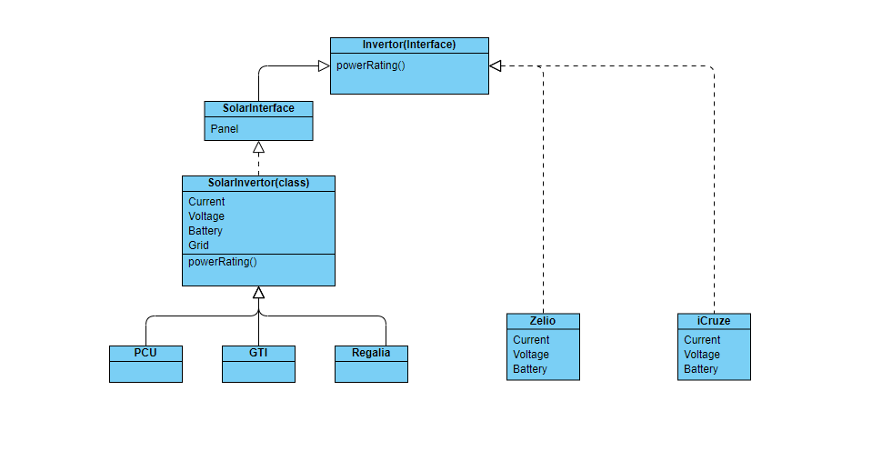

# Craterzone Invertor Project

---

- Name: Mukul Chauhan
- University: DIT, Dehradun, Uttarakhand
- Language Used: Java
- Email: mukulc67@gmail.com

---

It's a project given by craterzone company. It is build using **java** with focus on `OOPs`.

## Project Details

**Features**
- Object Oriented programming
- Abstraction
- Polymorphism
- Encapsulation
- Java

**How to run the project**

Steps: 
1. Extract the given zip folder or clone the github repo.
2. Open the project in any IDE available (preferrably Eclipse)
3. Run the project using the `Build and Run` button or use the shortcut (in Eclipse `f6`)

